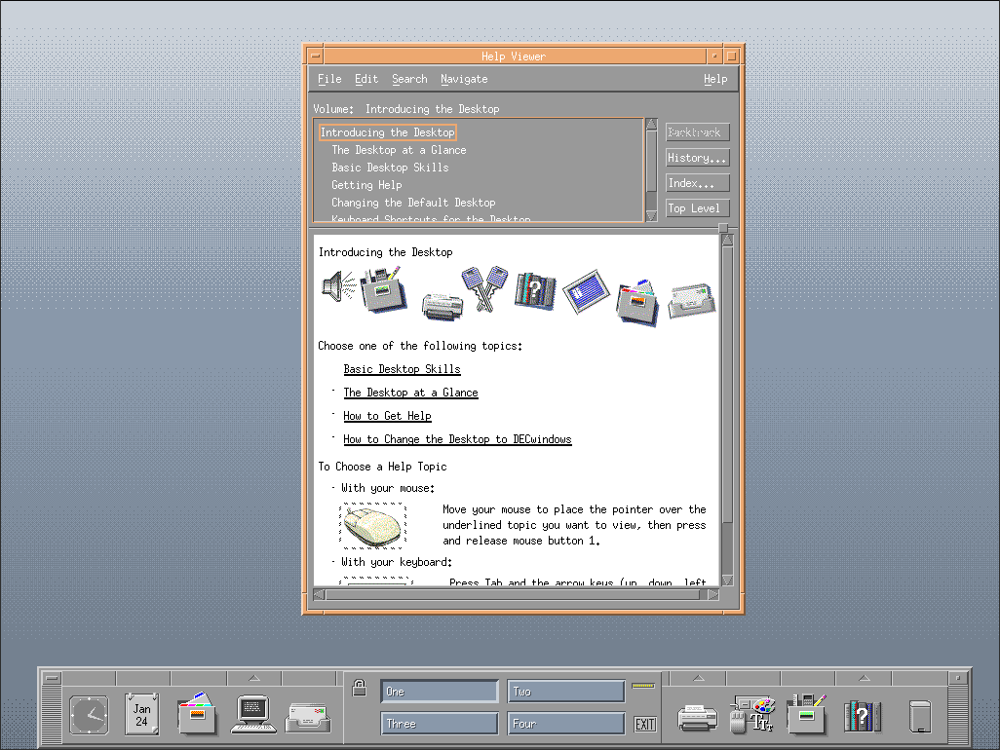
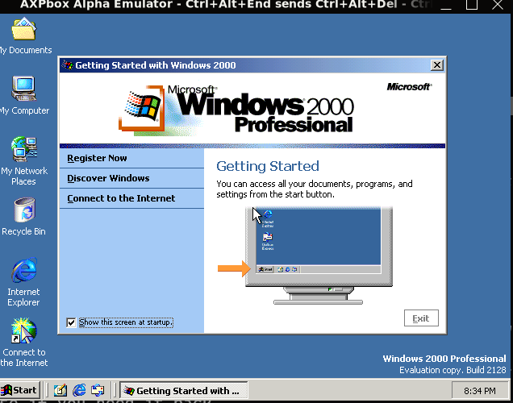

# AXPbox Alpha emulator

AXPbox is a fork of the discontinued es40 emulator. It could theoretically used for running any operating system that runs on the OpenVMS or Tru64 PALcode (e.g. OpenVMS, Windows 2000, Tru64 UNIX, Linux, NetBSD),).

The emulator supports SCSI, sound, IDE, serial ports, Ethernet (using PCAP) and [VGA graphics](https://github.com/lenticularis39/axpbox/wiki/VGA) (using SDL).

A lot of newer features are ported from [ES40-Emu/es40](https://github.com/ES40-Emu/es40) using Claude. You should check out that fork if you do not want to use AI code.




OpenVMS 8.4 desktop in AXPbox. [Here is a wiki page showing you how to get this CDE desktop running](https://github.com/lenticularis39/axpbox/wiki/GUI-Desktop-Environment-(CDE))



Windows 2000 build 2128 running on AXPbox. [Full guide to install Windows 2000 here](https://web.archive.org/web/20260705122517/https://www.zx.net.nz/computers/dec/axpemu-es40.shtml)


## Getting AXPbox

Pre-built binaries for generic Linux amd64, Windows 11 amd64 and macOS amd64 are available for each release, and also as artifacts produced for each commit in CI. T2 SDE has an [official package](http://t2sde.org/packages/axpbox) for AXPbox, and openSUSE's Emulators project has an [AXPbox package](https://build.opensuse.org/package/show/Emulators/axpbox), too. The former gets updated the same day when a release happens, while requests are submitted now the latter that undergo approval of Emulators maintainers.

You can also build from source using CMake; you need a C++17 compiler, optional dependencies are PCAP for networking and SDL3 or X11 for graphics support.

## Usage

First invoke the interactive configuration file generator:
```
axpbox configure
```
This creates a file named es40.cfg, which you can now modify (the generator UI doesn't allow to set all options). The sample [es40.cfg](es40.cfg) in the repository root documents every available configuration value. After the configuration file and the required ROM image are ready, you can start the emulation:
```
axpbox run
```

Please read the [Installation Guide](https://github.com/lenticularis39/axpbox/wiki/OpenVMS-installation-guide) for information to get OpenVMS installed in the emulator. A guide for NetBSD is [also available on the Wiki](https://github.com/lenticularis39/axpbox/wiki/NetBSD-9.2-install-guide)


### x86-64 JIT

An optional JIT (ported from [ES40-Emu/es40](https://github.com/ES40-Emu/es40), based on asmjit) can be enabled at build time on x86-64 hosts:

```
git clone https://github.com/lenticularis39/axpbox
cd axpbox # repo folder
git clone https://github.com/asmjit/asmjit third_party/asmjit
git -C third_party/asmjit checkout 0bd5787b54b575ed94bf32ac452153b34385c514
cmake -B build -DCMAKE_BUILD_TYPE=Release -DES40_DISABLE_ASMJIT=OFF
cmake --build build
```

### S3 Trio64 graphics / ARC / Windows NT

The S3 Trio64 emulation (ported from [ES40-Emu/es40](https://github.com/ES40-Emu/es40) uses the real S3 VGA BIOS; obtain `86c764x1.bin` from the [86Box ROM set](https://github.com/86Box/roms/tree/master/video/s3) and point the s3 config section at it (see the sample es40.cfg). This is required for the ARC/AlphaBIOS console and Windows NT-family guests: flash AlphaBIOS from the Alpha Systems Firmware v7.3 CD, then enter `arc` at the SRM prompt.


### Serial consoles, networking, and sound

- **Serial ports**: the sample config attaches both UARTs as `null_attach`
  (present but unconnected), so the emulator starts without waiting for
  anything and the console lives on the VGA window (`vga_console = true`).
  To use a telnet console instead, set `port = 21264;` in a serial section —
  note the emulator then **waits at startup** until a client connects
  (`nc localhost 21264`). Ports left out of the config entirely are
  synthesized as `null_attach` automatically.
- **Networking**: the DEC 21143 NIC (`pci0.4 = dec21143`) bridges to a host
  interface via pcap. Set `adapter = "eth0";` (Linux) or the
  `\Device\NPF_{...}` name (Windows/npcap). On Linux, grant the binary
  capture permission once:
  ```
  sudo setcap cap_net_raw,cap_net_admin+eip ./axpbox
  ```
  otherwise startup fails with "Error opening adapter". Don't leave
  `adapter` unset on unattended runs — the emulator interactively asks
  which adapter to use. Optional values: `mac` (default
  `08-00-2B-E5-40-<nic#>`), `queue` (rx queue depth, default 1024),
  `crc`, `trace_packets`.
- **Sound**: `pci1.1 = es1370 {}` adds an Ensoniq AudioPCI ES1370 (SDL
  builds). Guest drivers exist for Windows NT 4; other guests ignore it.
- **Mouse**: click the window to grab, Ctrl+F10 to release; `mouse.speed`,
  `mouse.invert_x`, `mouse.invert_y` in the `sdl` section tune it (see the
  WSLg note below). `video.scale_ratio` / `video.scale_change_enable`
  control window scaling (Ctrl+PageUp / Ctrl+PageDown at runtime).
- **CD images**: a cdrom `file` ending in `.cue` is parsed as a BIN/CUE
  image (multi-file, MODE1/MODE2/audio tracks); anything else is treated
  as a flat ISO.

### Headless testing and input-injection hooks

For automated or headless testing (CI, AI, scripted firmware navigation, driving
the emulator over SSH), the SDL GUI honors a set of debug environment
variables. They are read at startup; unset means disabled. Combined with
`SDL_VIDEO_DRIVER=offscreen` the whole GUI stack runs without any visible
window or display server.

| Variable | Effect |
|---|---|
| `AXPBOX_DUMP_FB=<prefix>` | Write the emulated screen as a PPM image (`<prefix>-NNN-WxH.ppm`) every ~2 seconds. This is how you "see" the VGA output on a headless run. |
| `AXPBOX_KEYSCRIPT="<sec>:<key>,..."` | Press named keys at fixed second offsets from GUI start, e.g. `AXPBOX_KEYSCRIPT="40:a,41:r,42:c,43:enter"` types `arc` + Enter at the SRM prompt 40 s in. Good for boot flows whose timing you already know. |
| `AXPBOX_KEYPIPE=<file>` | Interactive variant: keys appended to `<file>` while the emulator runs are typed into the guest (one token per ~120 ms). Example: `echo "f2 down down enter" >> keys.txt` navigates an AlphaBIOS menu. Start with an empty file; the emulator remembers how far it has read. |
| `AXPBOX_AUTOKEY_ENTER=<sec>` | Press Enter every `<sec>` seconds (blunt tool for firmware "press any key" prompts). |
| `AXPBOX_AUTOMOUSE=<sec>` | Starting `<sec>` seconds in, inject synthetic PS/2 mouse motion (a repeating square pattern plus a periodic left click) directly into the guest, bypassing host input entirely. If the guest cursor moves with this but not with your real mouse, the problem is host-side SDL event delivery, not the emulated hardware. |
| `AXPBOX_MOUSE_DEBUG=1` | Trace every host mouse-motion event, grab/focus transition, and relative-mouse-mode failure to stderr (`MOUSEDBG ...` lines). |
| `AXPBOX_PC_SAMPLE=1` | Print the guest program counter on every CPU state poll (~100 ms) — identifies where a guest is stuck on headless runs. |

Key names for `AXPBOX_KEYSCRIPT`/`AXPBOX_KEYPIPE`: `a`–`z`, `0`–`9`,
`enter`, `esc`, `tab`, `space`, `up`, `down`, `left`, `right`, `del`, `ins`,
`home`, `end`, `bksp`, `bslash`, `dot`, `minus`, `equals`, `f1`–`f12`,
`pgup`, `pgdn`.

A typical fully headless firmware run:

```
SDL_VIDEO_DRIVER=offscreen AXPBOX_DUMP_FB=fb \
AXPBOX_KEYPIPE=keys.txt AXPBOX_KEYSCRIPT="40:a,41:r,42:c,43:enter" \
axpbox run &
# ... watch fb-*.ppm to see the screen, echo keys >> keys.txt to react
```

Note: a `serial` section configured with a `port` waits for a telnet
connection at startup before the GUI comes up — connect a client (e.g.
`nc localhost <port>`) or configure `null_attach = true` for unattended runs.

### Mouse on WSLg / Wayland

Click inside the emulator window to grab the mouse; Ctrl+F10 releases it.
On WSLg (Windows Subsystem for Linux GUI) the default Wayland backend
delivers **no relative mouse motion** while the grab is active — the guest
pointer never moves even though the grab succeeds. Run the emulator through
XWayland instead:

```
SDL_VIDEO_DRIVER=x11 DISPLAY=:0 SDL_RENDER_DRIVER=software axpbox run
```

(`SDL_RENDER_DRIVER=software` avoids a fatal GLX error under WSLg's
XWayland.) Diagnose mouse problems with `AXPBOX_MOUSE_DEBUG=1`: motion
lines with `grab=1` mean host input reaches the guest; none after a
`grab -> 1` line means the host backend isn't delivering relative motion.

## Changes in comparison with es40

- Renamed from es40 to AXPbox to avoid confusion with the physical machine (AlphaServer ES40)
- CMake is used for compilation instead of autotools
- OpenVMS host support was dropped
- es40 and es40_cfg were merged into one executable (axpbox)
- The code was cleaned to compile without warnings on most compilers
- Code modernizing, replacing POCO framework parts by native C++11 counterparts not available in 2008 (std::threads, etc)
- Incorporate various patches from other es40 forks, for example, added MC146818 periodic interrupt to allow netbsd to boot and install, skip_memtest for faster booting.
- The [ES40-Emu/es40](https://github.com/ES40-Emu/es40) revival work is ported (at its 2026 state): MAME-based S3 Trio64/IBM 8514A graphics, ARC/AlphaBIOS + Windows NT/2000 device support, wall-clock guest timing, interpreter correctness fixes, firmware flash updates with system reset, and the optional asmjit x86-64 JIT.
- Bug fixes, less segfaults, overall less crashes. 
- [More](https://github.com/lenticularis39/axpbox/wiki/) documentation and usage information on the various features and operating systems

## What doesn't work (also see issues)

- Some guest operating systems (see [Guest support](https://github.com/lenticularis39/axpbox/wiki/Guest-support))
- Multiple CPU system emulation
- Running on big endian platforms
- Some SCSI and IDE commands
- Copying large files between IDE CD-ROM to IDE hard drive (this usually doesn't affect OpenVMS installation)
